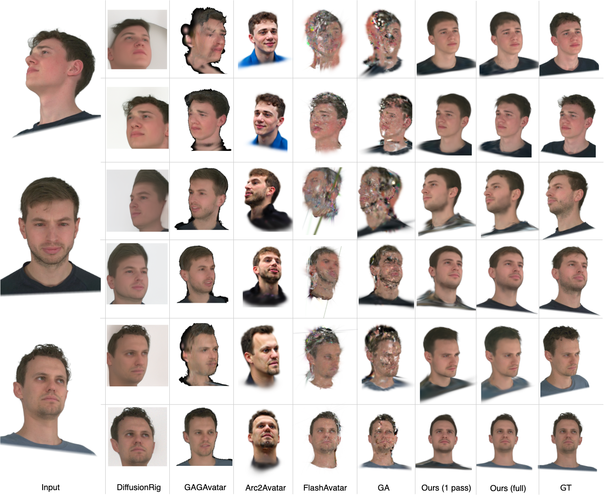

# FastAvatar: Instant 3D Gaussian Splatting for Faces from Single Unconstrained Poses

[](https://www.python.org/)
[](https://pytorch.org/)
[](LICENSE)

## Overview

We introduce FastAvatar, which achieves real-time 3D face reconstruction from a single image under unconstrained poses, combining high fidelity with speed.

### Key Features
- 🎯 **Pose-invariant face encoding**
- 🔧 **Single-shot Gaussian Splatting** with learnable parameters
- 📊 **Multi-view consistency** through COLMAP integration
- ⚡ **Real-time rendering** capabilities

## Quick Start

### Prerequisites
- Python 3.10 or higher
- CUDA 12.1 or higher (for GPU support)

### Installation

```bash
# Clone the repository
git clone https://github.com/hliang2/FastAvatar.git
cd FastAvatar

# Create virtual environment
conda create --name fastavatar -y python=3.10
conda activate fastavatar

# Install PyTorch (adjust CUDA version as needed)
pip install torch==2.1.0+cu121 torchvision==0.16.0+cu121 --index-url https://download.pytorch.org/whl/cu121

# Install dependencies
pip install -r requirements.txt
```

### Download Pretrained Models
Pretrained models can be downloaded **[here](https://drive.google.com/file/d/1SQOx8kHnnaqaCv_PjUqbVMYRzUOtUZuM/view?usp=sharing)**
```bash
# Create directories
mkdir -p pretrained_weights

# Download pretrained encoder and decoder
# Place them in pretrained_weights/
```

## Basic Usage

### Inference

```python
# Basic training with default parameters
python scripts/infrence.py

# Custom learning rates and regularization
python scripts/infrence.py \
    --sample_id 306 \
    --max_epochs 401 \
    --mlp_lr 2e-4 \
    --w_lr 1e-4 \
    --scale_reg 0.01 \
    --pos_reg 0.001

# Using different LPIPS network
python src/train.py --sample_id 306 --lpips_net vgg
```

### Data Preparation

```bash
# Structure your data as follows:
data/
├── <sample_id>/
│   ├── images/           # Input images
│   ├── sparse/           # FLAME-COLMAP reconstruction
│   │   ├── 0/
│   │   │   ├── cameras.bin
│   │   │   ├── images.bin
│   │   │   └── points3D.bin
│   └── poses_bounds.npy  # (optional) Camera bounds
```


## 📁 Project Structure

```
FastAvatar/
├── scripts/
│   ├── model.py                 # Model architectures  
│   ├── dataset.py              # Data loading and processing   
│   ├── inference.py                # Feed-forward Inference script 
│   └── utils.py                # Utility functions      
├── data/                       # Dataset directory (not included)
│   └── <sample_id>/           # Individual samples
├── pretrained_weights/         # Pretrained models
├── results/                    # Output directory
```


## Results

<table>
  <tr>
    <td align="center"><b>Comparison with SOTAs</b></td>
  </tr>
  <tr>
    <td></td>
</table>


## Acknowledgments

This project builds upon several excellent open-source projects:

- **[3D Gaussian Splatting](https://github.com/graphdeco-inria/gaussian-splatting)** - The foundational 3D Gaussian Splatting paper and implementation by Kerbl et al.
- **[gsplat](https://github.com/nerfstudio-project/gsplat)** - Efficient CUDA kernels for differentiable Gaussian rasterization from Nerfstudio
- **[InsightFace](https://github.com/deepinsight/insightface)** - State-of-the-art face analysis toolkit for face recognition and embedding
- **[VHAP](https://github.com/ShenhanQian/VHAP)** - Head Tracking with FLAME

Special thanks to the authors of these works for making their code publicly available.

## Citation

If you find this work useful for your research, please consider citing:

```bibtex
@misc{****}
```


## Contributing

Contributions are welcome! Please feel free to submit a Pull Request. For major changes, please open an issue first to discuss what you would like to change.

## License

This project is licensed under the MIT License - see the [LICENSE](LICENSE) file for details.


**Note**: This project is for research purposes. Please ensure you have appropriate rights and consent when using face data.